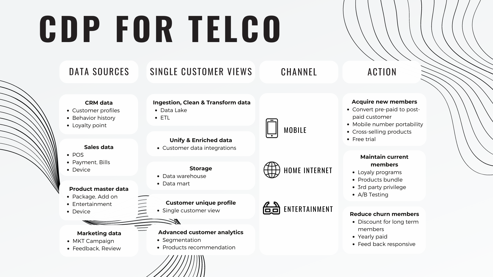
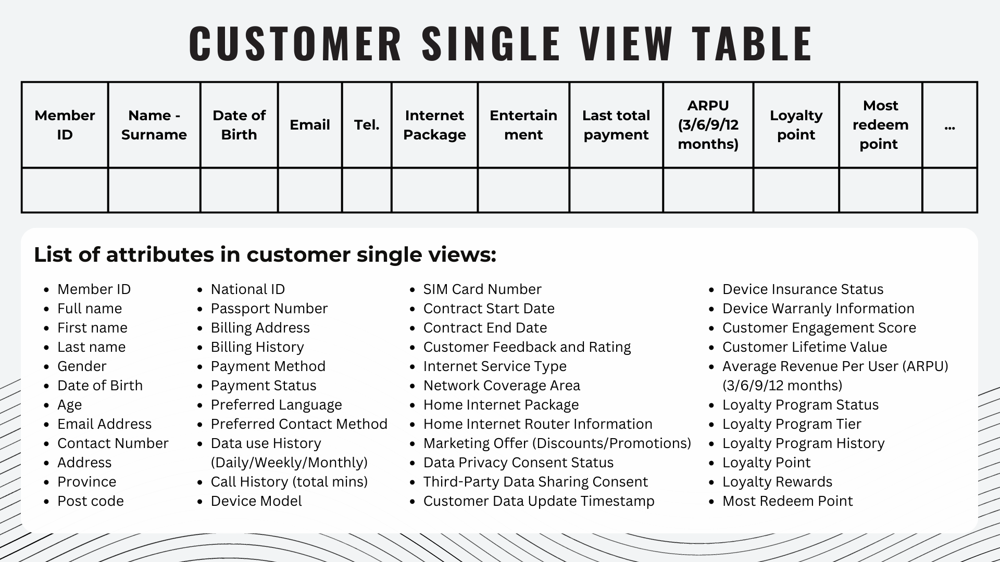

# Customer Data Platform
  
### My customer data platform design for Telecommunication Company including customer single view table and use case suggestion for business.

## Customer Data Platform Design

## Customer Single View Table

## Use Case suggestion
### Acquire new customer, Maintain current customer and Reduce churn customer
1. Segment customer using features in customer single view table and personalised promotion by each group.
2. Recommend the right product to the right person (Phone, SIM Card, Home Internet, Entertaionment).
3. Easy to track and update customer consent and perferred contact method and language.
4. A/B testing can be applied to test between differences campaign.
5. Provide multidimensional feature for Churn prediction.
