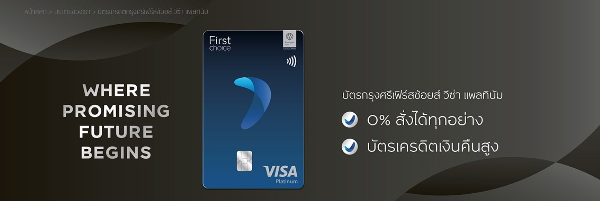

# Customer Lifetime Value
  

The objective is to identify a business, analyze its existing customer, and recommended new CLV Model

## First choice credit card

"First choice" is credit card that allow you to split payment transaction into 3 bills with 0% offer, money loan and other promotions
