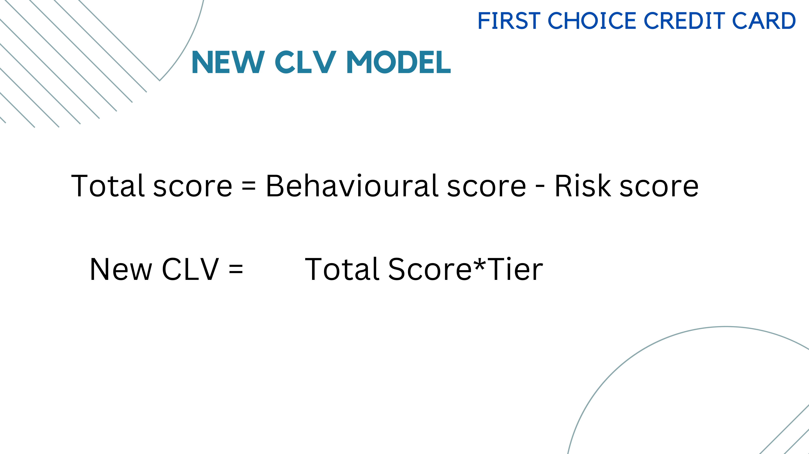
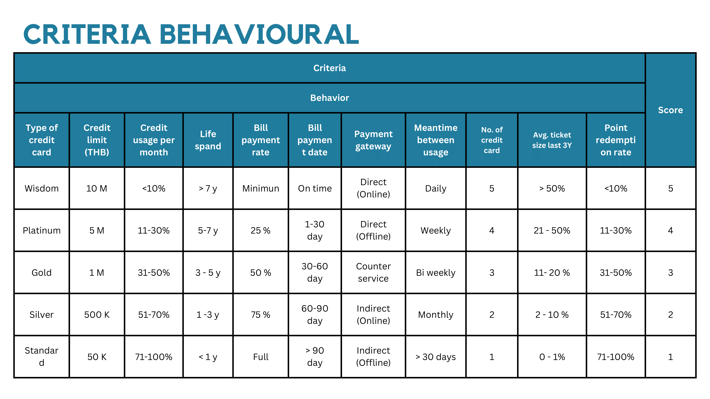
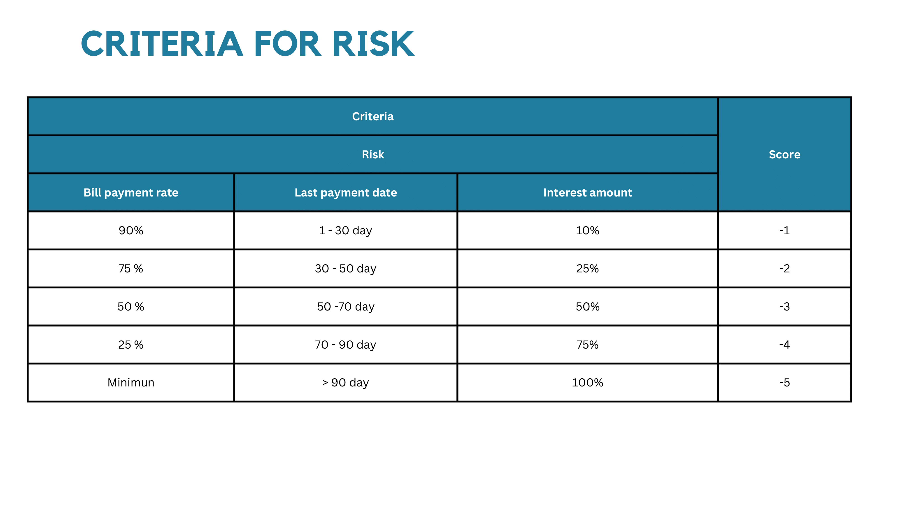
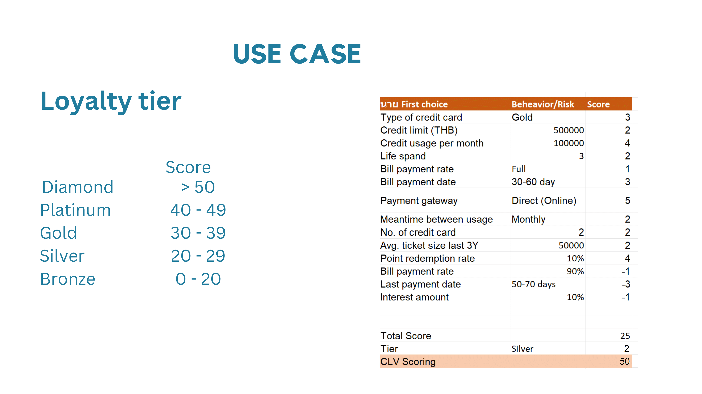
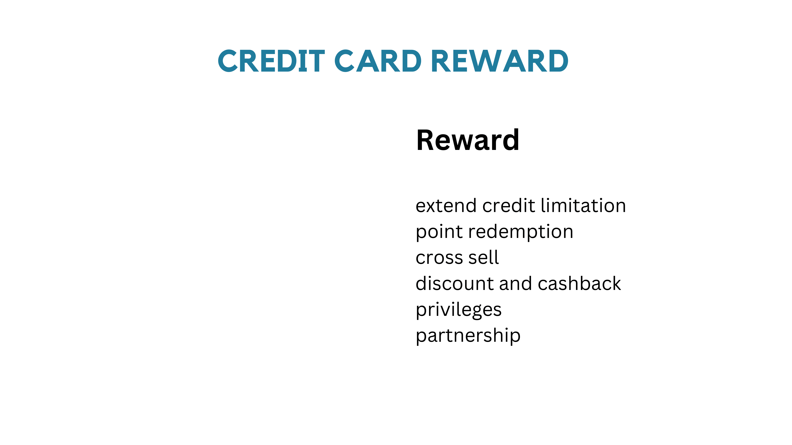

# Customer Lifetime Value
  

The objective is to identify a business, analyze its existing customer, and recommended new CLV Model

## First choice credit card

"First choice" is credit card that allow you to split payment transaction into 3 bills with 0% offer, money loan and other promotions

## Hypothesis
We assume that more customer are more probability of bad debt so we design new model to evaluate CLV base on Behavioural score and Risk score (by rule base)
then multiply by customer Tier (from Loyalty point)

### Rule base Behavioural score

### Rule base Risk score

### Use case

## Expectation
Segment customer by CLV score and set up different marketing campaign to the customer
if CLV score is high we can give them more benefit such as spilt payment treansaction into 12 bills instead of 3 bills.
because customer with high CLV score mean less probability of bad debt.

