# Churn Scoring
  

## Dataiku (https://www.dataiku.com/)
The world's leading platform for Everyday AI, systemizing the use of data for exceptional business results.
I use this tools to EDA, create model, parameter tuning, and deploy

## Dataset
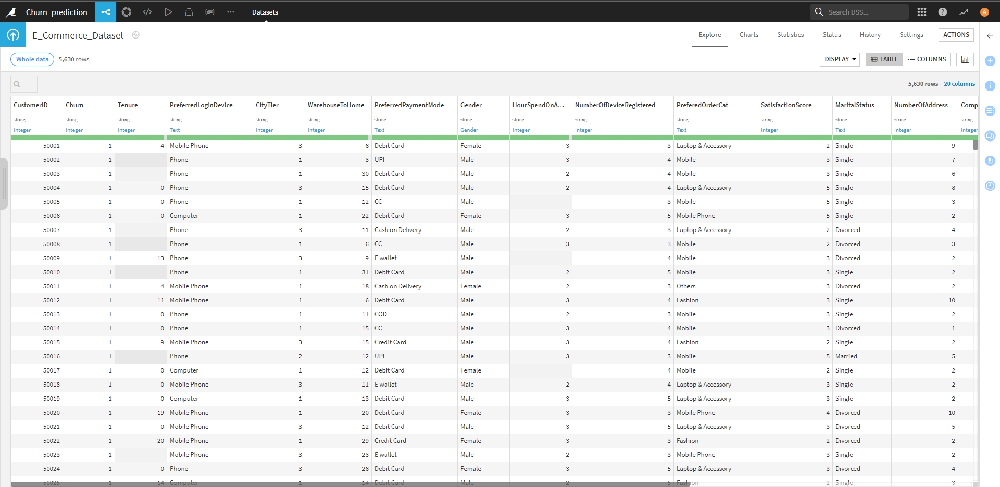
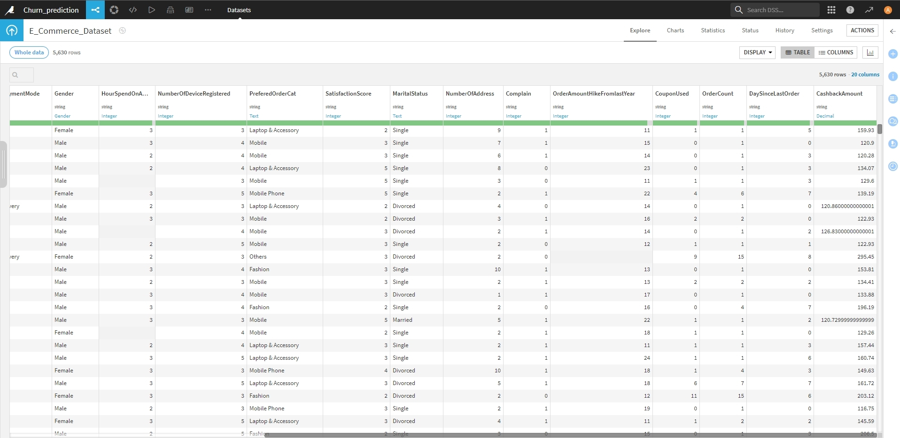

## EDA
by Churn Flag

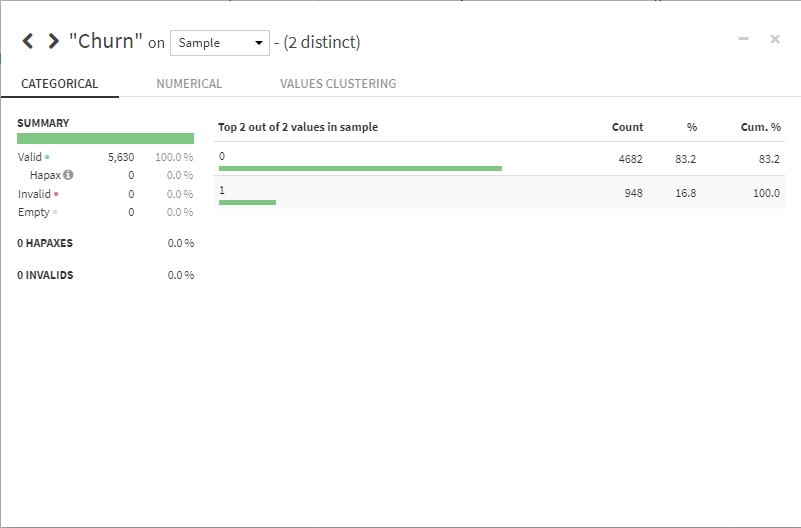

### Cleansing data
Remove rows with empty value in:
-  `Tenure ` 264 rows
-  `WarehouseToHome ` 251 rows
-  `HourSpendOnApp ` 255 rows
-  `OrderAmountHikeFromlastYear ` 265 rows
-  `CouponUsed ` 256 rows
-  `OrderCount ` 258 rows
-  `DaySinceLastOrder ` 307 rows

Total deleted 1,856 rows | Remain 3,774 rows

### Summary Statistics
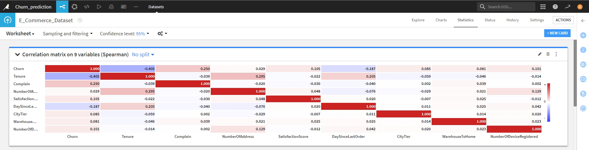
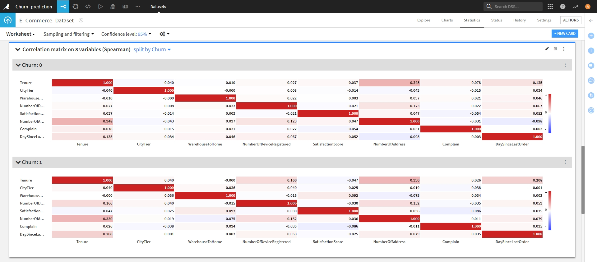

### PCA variable
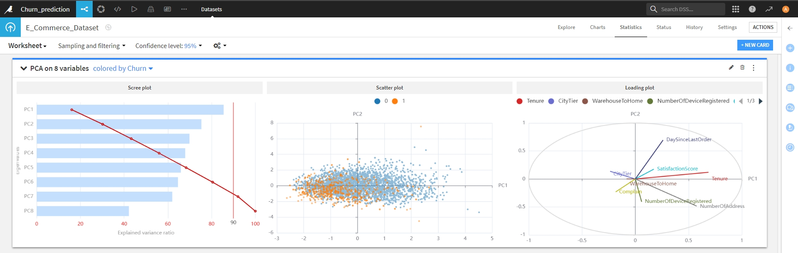

### Parallel Coordinates Plot
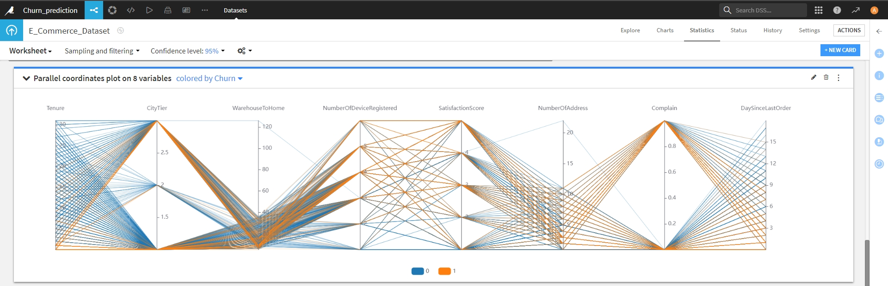

## Model Creation & Evaluation
Random dataset and split `Trainset ` and `Validateset `

- Using: `Random Forest `, `Logistic Regression `, `XGBoost `
- Metrics: `Precision `, `F1 score `
- Best performing Model: `Random Foreset `
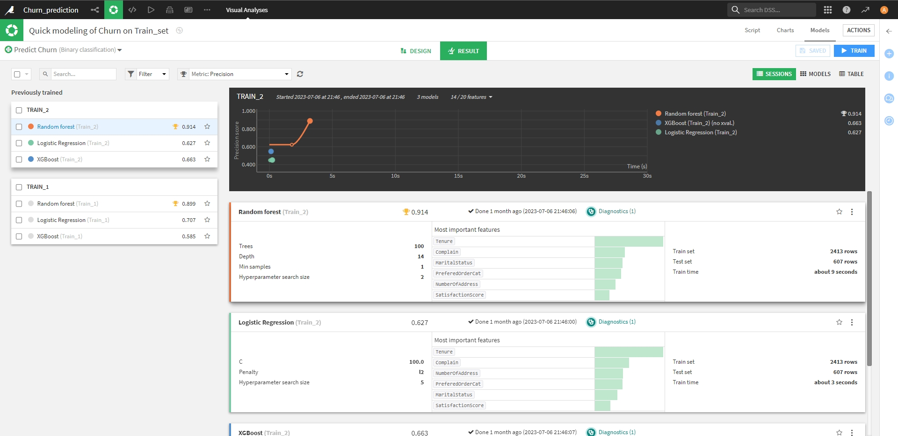

## Feature Improtance
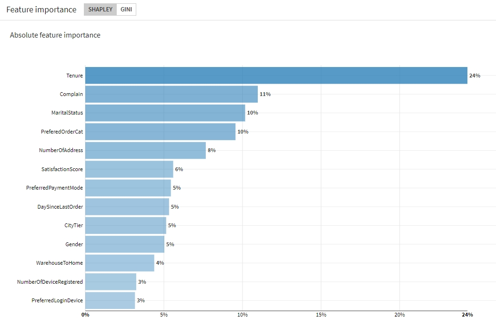

### Confusion matric
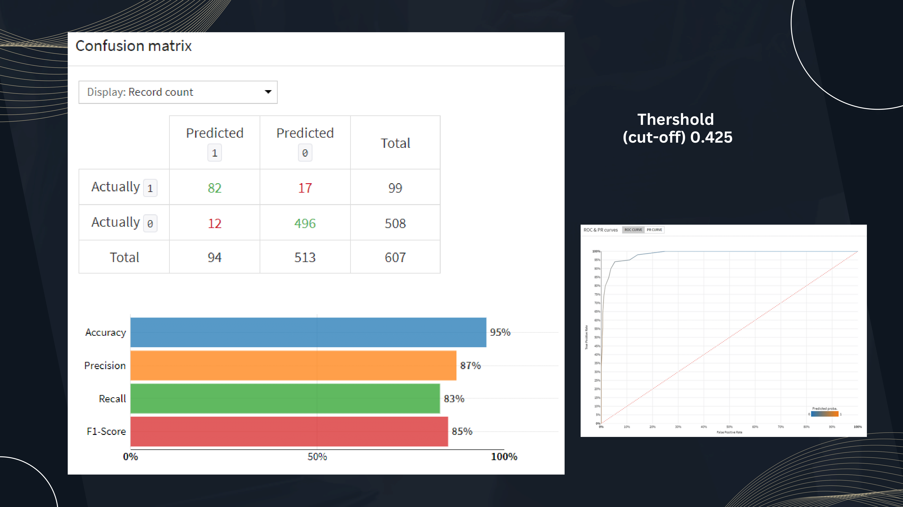

## Deploy Model
### Predict Churn Customer
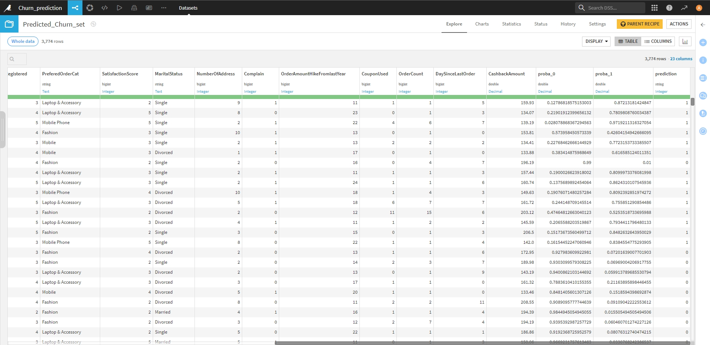

### Classification
- KMean = 4
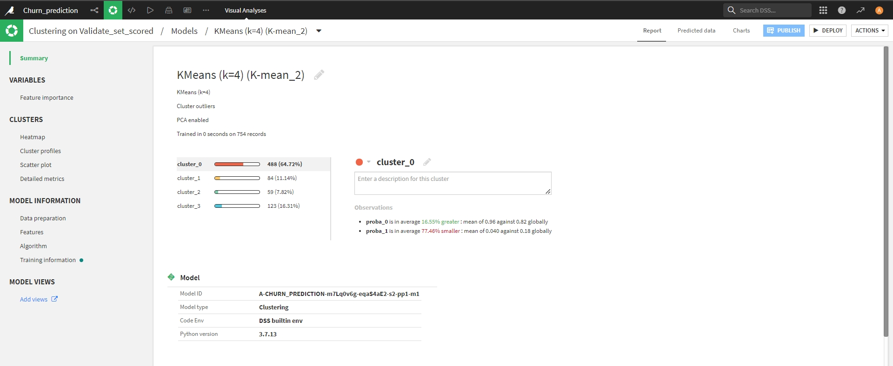

### Segmentation
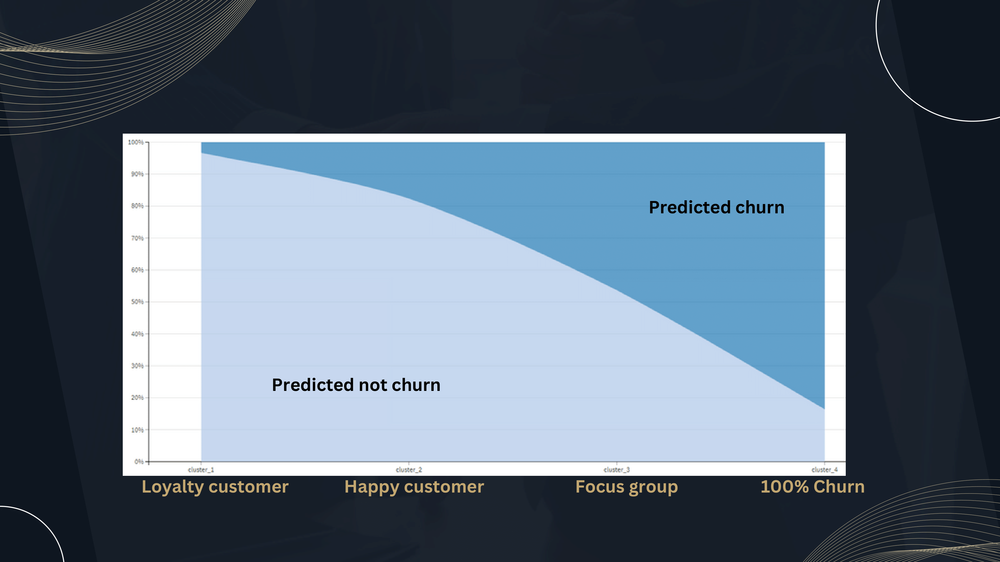

## Action
### Focus group
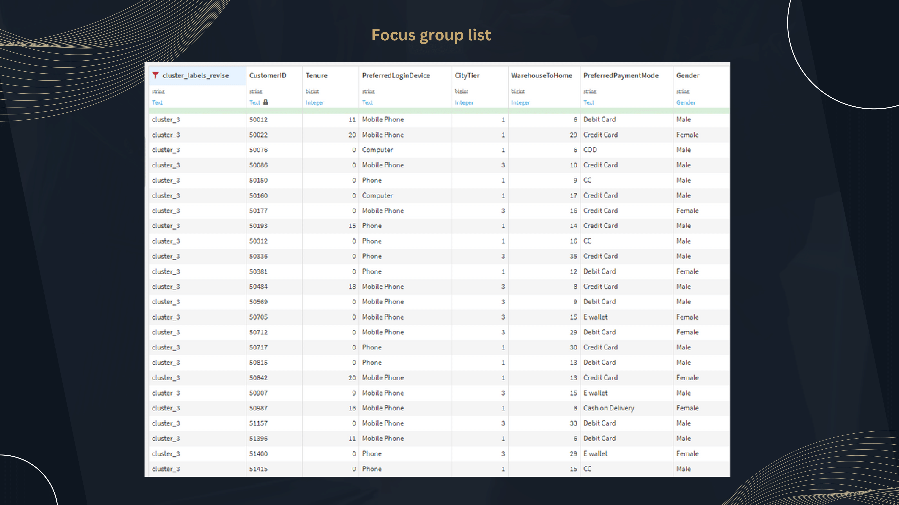

### Marketing Plan

