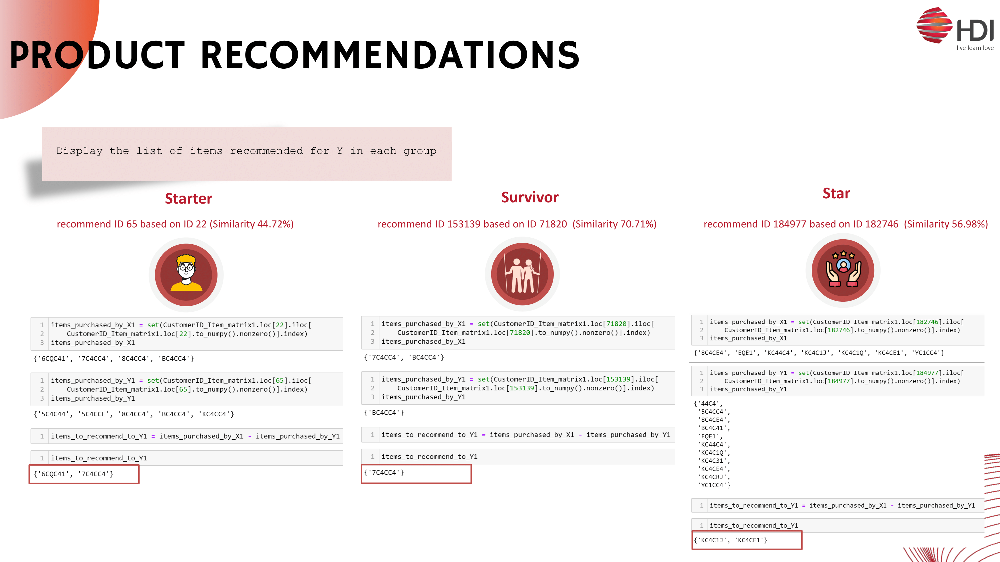

# Customer Segmentation and Product Recommendation
  

# Project objective

# Dataset
HDI is distribution company supported by various effective health products for dynamic modern life such as health supplements, health supplements for kids, healthy food and drink, natural personal care and skin care.
### Data understanding

### Sanity check

### Assumption
- Focus on total amount by ignoring paid amount because there are only 50K members were pain more than zero from total customer around 578K members.
- Using data from the most recent two months in 2023, recommend a product in each cluster due to computing power limitation.

# Create customer single view
list of feature

# Customer segmentation

### Feature Improtant

# K-mean
Consider number of cluster by elbow and silhouette

### Clustering result

### Cluster interpretation

# Product recommendation
Create user to user similarity metric in each cluster for recommended product.

### Performance eveluation

