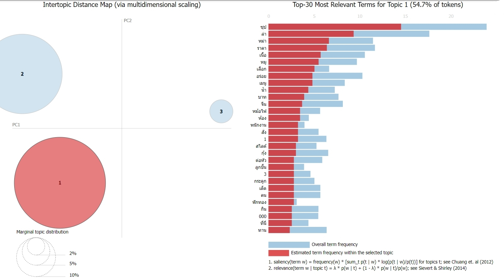
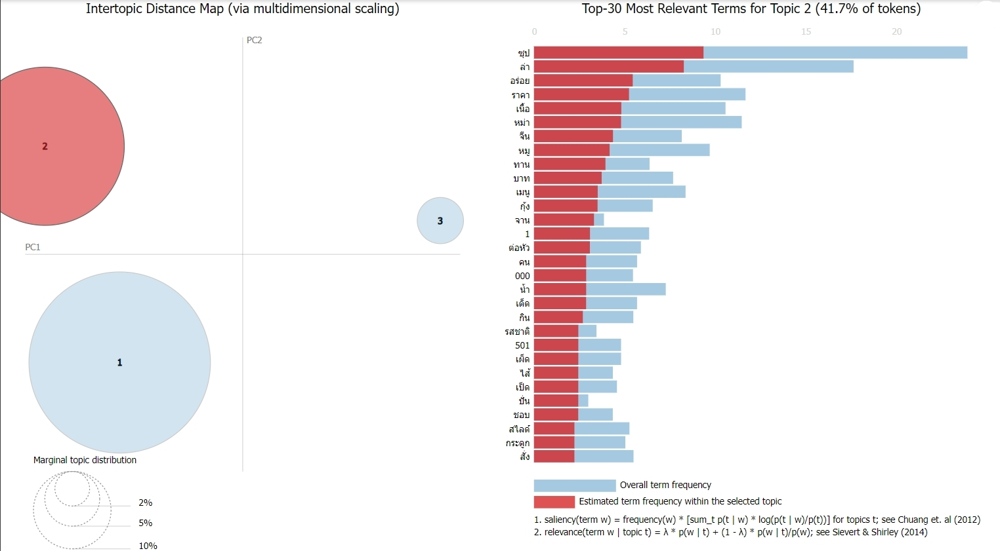
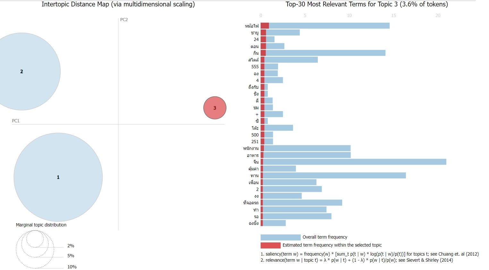

# Voice of Customer Analytics
    

# Project Overview
This project focus on Wongnai review for CQK Hotpot using Natural Language Processing (NLP) techniques. By analyzing a sample of 30 comments from a selected review to uncover topics within the comments, providing insights into the discussions and interests of the users.

# Topic Modeling
**Notebooks:** [Topic Modeling](./Review_CQK_NLP.ipynb)  
**Google Colab:** [Google colab](https://colab.research.google.com/drive/1-JJyuCzIB-OlCsxC3YES1FwtYvJmjrST)

# Result analysis
## Topic 1: Recommend product by most popular item.
 

## Topic 2: The two soup order at the same hotpot simultaneously.
 

## Topic 3: Another a la cart order
 

# Word Cloud
 

# Business Recommendation
Most topic review about Mala soup hotpot the main CQK selling point, the restaurant should recommend protein and vegetable that customer can enjoy with Mala soup, promotion set menu with Mala soup, and promote pork bone soup or pumkin soup for the second soup in hotpot.
